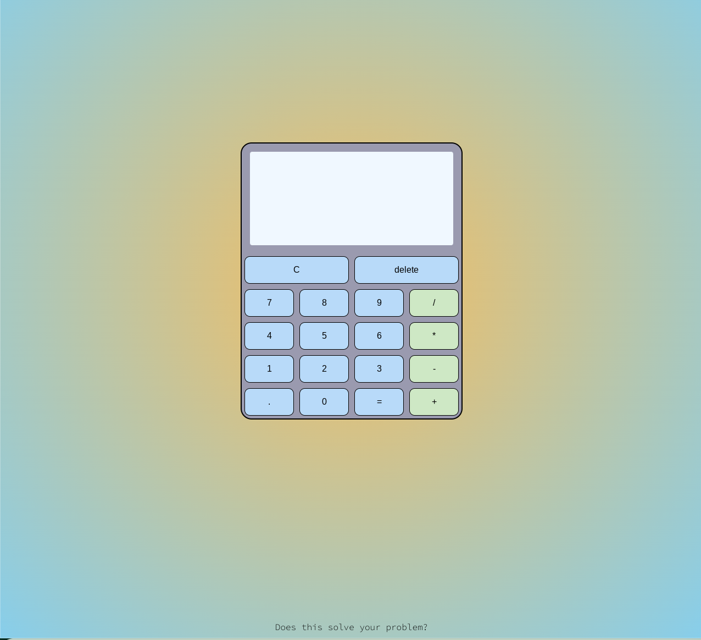

# Calculator

A calculator that can string multiple operations, use float numbers, delete and clear. 

Here is a link to a live demo: https://friedrichtenhagen.github.io/calculator/

## How it's made:

### Tech used: HTML, CSS, Javascript

A event listener is added to every key. On click a digit is added to the screen or, in the case of an operator, an operation is performed. 
The C key clears all variables as well as the screen. 
The delete key deletes the last digit. 

## Lessons learned: 
This was a good practice of connecting a simple user interface with javascript functions via eventlisteners. 
I got to use switch statements to evaluate an expression against a multitude of cases. 
The cool background was created using a radial gradient. 